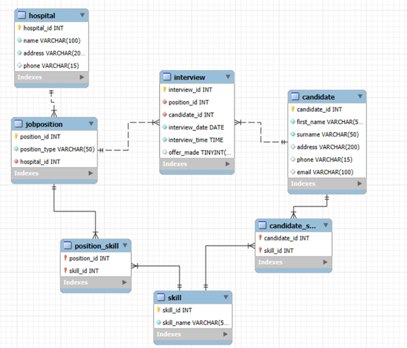

# Hospital Recruitment Database

A relational database system designed to manage hospital recruitment across Ireland and Finland.

Note: This project is associated with University College Dublin.

## Features

- 7-table relational schema
- Many-to-many relationships using junction tables
- Stored procedures for inserting and querying data
- ER diagram included

## Database Structure

Core tables:

Hospital  
Candidate  
Skill  
JobPosition  
Interview  

Junction tables:

Candidate_Skill  
Position_Skill  

## ER Diagram

## Setup

Run SQL scripts in order:

1. sql/01_create_database.sql
2. sql/02_schema.sql
3. sql/03_insert_procedures.sql
4. sql/04_seed_data.sql
5. sql/05_queries.sql
